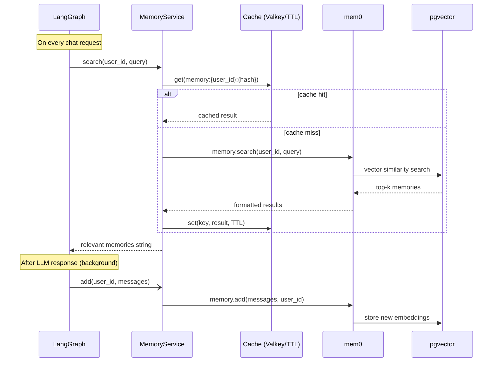

# Memory

## Overview

The template includes a long-term memory system powered by [mem0](https://github.com/mem0ai/mem0) and pgvector. Memories are extracted from conversations, stored as vector embeddings, and retrieved semantically on each request — giving the agent context from past sessions.

## How it works



## Cache layer

Memory search results are cached to avoid repeated pgvector queries for similar questions within the same TTL window.

- **With Valkey/Redis**: cache is shared across app instances. Set `VALKEY_HOST` in your `.env`.
- **Without Valkey**: falls back to an in-memory `TTLCache` — works fine for single instances.

Cache key: `memory:{user_id}:{sha256(query)[:16]}`
TTL: `CACHE_TTL_SECONDS` (default: 60s)

Only successful, non-empty results are cached. Errors are never cached.

## Memory updates

After the LLM produces a response, memories are updated **in the background** via `asyncio.create_task`. This means:
- The response is returned immediately, without waiting for mem0 to finish
- Memory updates don't block or slow down the chat response

## Configuration

| Variable | Default | Description |
| --- | --- | --- |
| `LONG_TERM_MEMORY_COLLECTION_NAME` | `longterm_memory` | pgvector collection name |
| `LONG_TERM_MEMORY_MODEL` | `gpt-5-nano` | LLM used by mem0 to extract and process memories |
| `LONG_TERM_MEMORY_EMBEDDER_MODEL` | `text-embedding-3-small` | Embedding model for semantic search |
| `LONG_TERM_MEMORY_DISABLE_THINKING` | `true` | Sends `thinking: {"type": "disabled"}` to skip reasoning passes on extraction |
| `LONG_TERM_MEMORY_CUSTOM_FACT_EXTRACTION` | `true` | Use the custom fact-extraction prompt instead of mem0's built-in one |
| `LONG_TERM_MEMORY_CUSTOM_UPDATE_MEMORY` | `true` | Use the custom update-memory prompt instead of mem0's built-in one |
| `CACHE_TTL_SECONDS` | `60` | Memory search cache TTL |

## Fact extraction prompt

Fact extraction is driven by `app/core/prompts/fact_extraction.md`, loaded once at
import time and passed to mem0 as `MemoryConfig.custom_fact_extraction_prompt`.

mem0 uses it as the **system message** and appends the conversation itself as
`Input:\n<user: ... assistant: ...>` in the user message — so the prompt must not
try to embed the conversation, and it must always end with the JSON contract:

```json
{"facts": ["...", "..."]}
```

Notes and gotchas:

- The field is **top-level** in `MemoryConfig`, not under `"llm"`. Nested under
  `llm.config` it is silently ignored by pydantic — memory writes keep working but
  your prompt never runs.
- Extraction parses the reply with a bare `json.loads(response)["facts"]`. A
  malformed reply is logged by mem0 and turns into **zero memories**; it does not
  raise into `MemoryService.add()`. Check the `mem0.fact_extraction` Langfuse span.
- Setting a custom prompt bypasses mem0's automatic choice between
  `USER_MEMORY_EXTRACTION_PROMPT` and `AGENT_MEMORY_EXTRACTION_PROMPT` (the latter
  triggers only when `agent_id` is present). Since this service only passes
  `user_id`, the built-in behaviour was always the user prompt anyway.
- The prompt also relies on the LLM to avoid storing credentials. Treat that as a
  probabilistic hint, not a security boundary — filter secrets in code before
  calling `memory.add()` if that matters for your deployment.

## Update memory prompt

The second pass — deciding ADD / UPDATE / DELETE / NONE against existing memories —
is driven by `app/core/prompts/memory_update.md`, passed as
`MemoryConfig.custom_update_memory_prompt`.

Unlike the extraction prompt, this one only replaces the **strategy header**.
mem0's `get_update_memory_messages()` always appends its own text after it:

- the current memory block (a list of `{"id", "text"}`, where IDs have already been
  rewritten to `"0"`, `"1"`, `"2"`, ... by `temp_uuid_mapping`)
- the new facts block
- the required JSON structure: `{"memory": [{"id", "text", "event", "old_memory"}]}`
- the fixed operation rules (empty memory means ADD everything, UPDATE keeps the
  same ID, DELETE removes the entry, ...)

So the output contract cannot be broken from the prompt, but it also cannot be
changed. Keep the file header-only: policy, conflict resolution and few-shot
examples written against index-style IDs.

Behaviour worth knowing:

- The pass runs only when extraction returned facts; an empty fact list skips it.
- It is a single **user** message (no system message) with
  `response_format={"type": "json_object"}`.
- Existing memories come from a per-fact vector search (`limit=5`), deduplicated by
  ID, so a large fact list means several searches before one LLM call.
- Invented IDs raise `KeyError` on the `temp_uuid_mapping` lookup, which is caught
  per-entry and only logged — the action is dropped silently. Likewise an entry
  with an empty `text` is discarded for every event, including `DELETE`.
- `NONE` only does something when the call carries an `agent_id` or `run_id`; this
  service passes neither, so it is a plain no-op.

Both custom prompts are construction-time only, so changes need a restart
(`MemoryService._get_memory()` caches the `AsyncMemory` instance). Each has its own
`LONG_TERM_MEMORY_CUSTOM_*` switch to fall back to mem0's built-in prompt without
reverting code.

## Startup pre-warming

At startup, `memory_service.initialize()` is called in the app lifespan. This establishes the pgvector connection pool and runs mem0's schema check, so the first user request doesn't pay the ~130ms cold-init cost.

## Per-user isolation

Each user's memories are stored and searched independently using `user_id` as the namespace. Users cannot access each other's memories.
